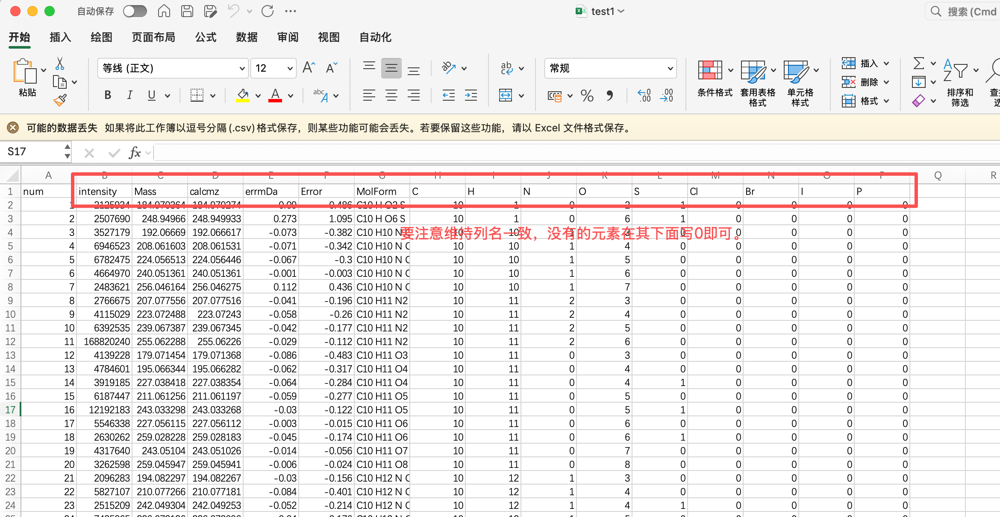
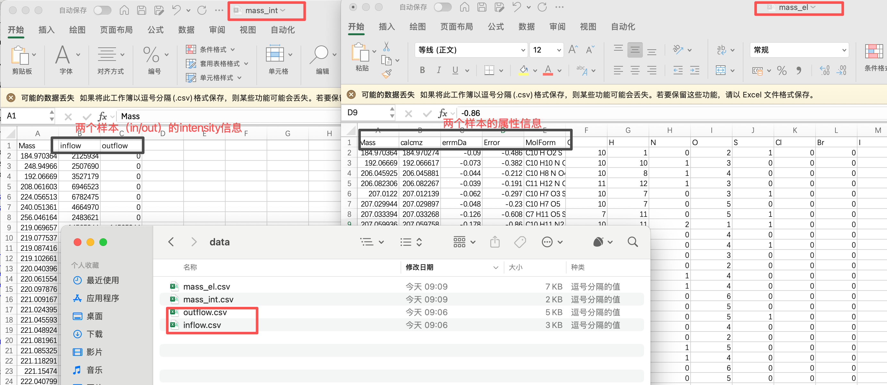
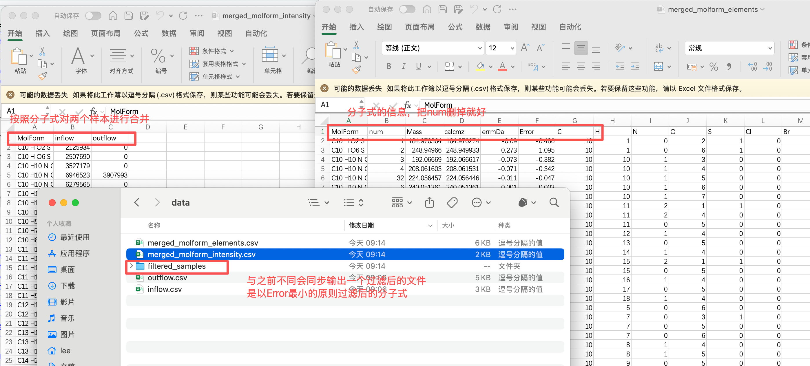
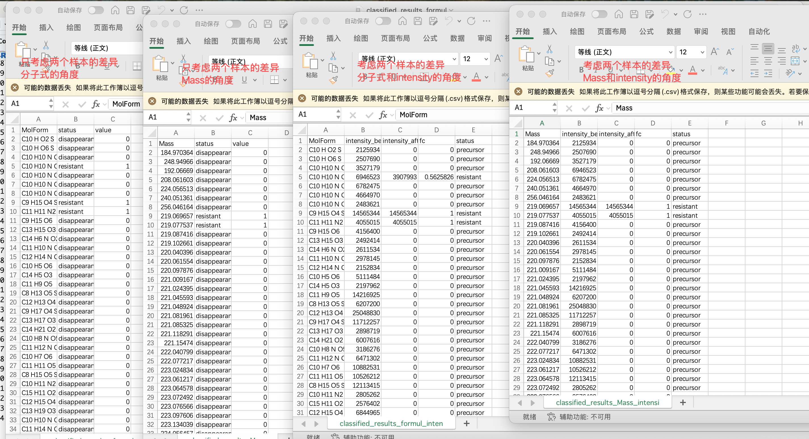

# ubynet

**ubynet** 是一个用于 **分子数据分析与转化网络构建** 的 R 包。  
它提供了从分子数据合并、质量差反应匹配，到构建基于成对质量差 (PMD) 的分子转化网络的完整工具链。  
适合处理 FTICR-MS 等超高分辨质谱数据的反应分析与分子转化研究。


整理成正式引用形式可以是这样：

> In order to facilitate the integration of FT-ICR MS data across multiple samples, our team has developed **ubynet**, a specialized R-based software suite that is available for download on GitHub ([https://github.com/uby76/ubynet](https://github.com/uby76/ubynet)).

如果要放在 **参考文献** 部分（软件引用），常见写法是：

**Software citation example (APA style):**

> Jianwei, L. (2025). *ubynet: An R package for molecular data analysis and transformation network construction*. GitHub repository. [https://github.com/uby76/ubynet](https://github.com/uby76/ubynet)

---

## 🔧 安装

确保已安装 [`remotes`](https://cran.r-project.org/package=remotes)：

```r
install.packages("remotes")
````

从 GitHub 安装 `ubynet`：

```r
remotes::install_github("uby76/ubynet")
```

---

## 🚀 使用示例


[`两个示例数据`](https://github.com/uby76/ubynet/tree/main/testdata)
### 所有的函数使用的数据格式均为此模版，注意列名一致即可！

---
### 1. 合并质量-强度数据（根据mass合并数据）

```r
library(tidyr)
library(ubynet)
#基于mass的匹配
#所有的csv文件放在E:/data/test，文件夹下
res <- merge_mass_intensity(
  dir_path = "E:/data/test",
  output_mass_intensity = "E:/data/test/mass_int.csv",
  output_mass_elements = "E:/data/test/mass_el.csv"
)
```


### 2. 合并分子式-强度数据（根据Molform合并数据）

```r
library(tidyr)
library(ubynet)
#基于molform的匹配
#所有的csv文件放在E:/data，文件夹下
dir_path <- "E:/data/test"
#合并后输出的intensity
output_molform_intensity <- "E:/data/test/merged_molform_intensity.csv"
#合并后输出的分子信息
output_molform_elements <- "E:/data/test/merged_molform_elements.csv"
#过滤后的样本（csv）存放位置
output_filtered_samples_dir <- "E:/data/test/filtered_samples"

peakObj <- merge_molform_intensity(
    dir_path = dir_path,
    output_molform_intensity = output_molform_intensity,
    output_molform_elements = output_molform_elements,
    output_filtered_samples_dir = output_filtered_samples_dir
)
```



### 3. 前后样本的差异（disappearance，product，resistant），慎重使用存在假阳性

```r
library(tidyr)
library(ubynet)
# 不考虑intensity的变化，根据MolForm进行分析
classify_MolForm("inflow.csv", "outflow.csv", "classified_results_formul.csv")
# 不考虑intensity的变化，根据Mass进行分析
classify_Mass("inflow.csv", "outflow.csv", "classified_results_Mass.csv")

# 考虑intensity的变化，根据MolForm进行分析
classify_MolForm_intensity("inflow.csv", "outflow.csv", "classified_results_formul_intensity.csv")
# 考虑intensity的变化，根据Mass进行分析
classify_Mass_intensity("inflow.csv", "outflow.csv", "classified_results_Mass_intensity.csv")
```


### 4. 基于分子式变化的反应匹配（慎重使用存在假阳性）

```r
library(tidyr)
library(ubynet)
match_res <- match_reactions_by_intensity(
  file1 = "inflow.csv",
  file2 = "outflow.csv",
  reaction_delta_file = "reaction_delta.csv",
  out_dir = "results"
)
```

### 5. 基于质量差的反应匹配（慎重使用存在假阳性）

```r
library(tidyr)
library(ubynet)
match_res2 <- match_reactions_by_mass_difference(
  file1 = "inflow.csv",
  file2 = "outflow.csv",
  reaction_delta_file = "reaction_delta.csv",
  out_dir = "results",
  mass_tolerance = 0.005 #设置容差
)
```


### 6. 基于已知的分子式和MASS计算的PMD反应网络（单样本）
### 参考文献：https://www.nature.com/articles/s41467-020-19989-y

```r
library(tidyr)
library(ubynet)
edges <- build_mass_pmd_network(
  mol_file = "MS_MolInfor1.csv",
  trans_file = "Transformation_Database_07-2020.csv",
  error_term = 0.00001,
  output_dir = "MS_MolInfor1"
)

```


### 7. 构建树（有三种构建方法）
### 参考文献：https://www.nature.com/articles/s41467-020-19989-y

### 7.1 基于的分子间转化关系构建系统发育树

```r
library(tidyr)
library(ubynet)
# 1. 这里要使用「1. 合并质量-强度数据」来进行分析，因为主要是调用的mass进行的差值
data <- read.csv("mass_int.csv", row.names = 1, check.names = FALSE)
mol  <- read.csv("mass_el.csv", row.names = 1, check.names = FALSE)
trans_db <- read.csv("Transformation_Database_07-2020.csv")

# 2. 行名转为数值并保证一致
rownames(data) <- as.numeric(rownames(data))
rownames(mol)  <- as.numeric(rownames(mol))
common_peaks <- intersect(rownames(data), rownames(mol))
data <- data[common_peaks, , drop = FALSE]
mol  <- mol[common_peaks, , drop = FALSE]

# 3. 转换为二进制（存在即为1）
data[data > 0] <- 1

# 4. 运行完整分析（包括转化检测和树构建）
result <- complete_transformation_analysis(
  data = data,
  mol = mol,
  trans_db = trans_db,
  sample_name = "data1",  # 输出文件前缀
  clustering_method = "average",
  build_tree = TRUE
)

```

### 7.2 基于的分子信息构建系统发育树

```r
library(tidyr)
library(ubynet)
#  尽可能的每一个样本中计算这些指数，列名一定要一致
#  指数信息："C", "H", "O", "N", "S", "P", "DBE", "AI_Mod", "kdefect"
#  比例信息："OtoC_ratio", "HtoC_ratio", "NtoC_ratio", "PtoC_ratio", "NtoP_ratio"

res <- build_molecular_dendrogram(
  mol_file = "mass_el.csv",
  sample_name = "data1",
  clustering_method = "average"
)

```
### 7.3 基于的分子信息和分子间转化关系构建系统发育树

```r
library(tidyr)
library(ubynet)
result <- build_weighted_dendrogram(
    mol_file = "mass_el.csv",
    peak2peak_file = "data1_peak.csv", 
    numtrans_file = "data1_trans.csv",
    sample_name = "data1"
)

```

---


```r
result <- calculate_car_matrix(
  csv_file = "data.csv",              # 输入 CSV 文件
  db_path = "FTICR_CAR_smart.db",     # 数据库路径
  car_min = 0.45,                      #
  car_max = 1.0,                       # 
  track_direction = TRUE,              # 是否追踪方向（+/-）
  top_n = 50,                          
  verbose = TRUE                       # 显示详细进度
)
```

```r
# 运行分析
result <- batch_car_analysis(
  sample_folder = "path/to/samples",
  db_output_folder = "path/to/databases",
  edge_output_folder = "path/to/edges",
  top50_file = "Top50_formula.csv",
  car_min = 0.45,
  car_max = 1.0
)
```

---

## 📖 部分函数说明

### `merge_mass_intensity()`

* **功能**：合并质量与强度数据，生成统一的质量-强度表。
* **输入**：CSV 文件目录
* **输出**：合并后的 mass-intensity 数据表 + 元数据

---

### `merge_molform_intensity()`

* **功能**：合并分子式与强度数据。
* **输入**：CSV 文件目录
* **输出**：合并后的 molform-intensity 数据表 + 元数据

---

### `match_reactions_by_intensity()`

* **功能**：基于两个样本的强度变化 + 分子式变化，匹配潜在反应。
* **输入**：两个 CSV 文件 + 反应定义表
* **输出**：反应网络边表、反应统计摘要

---

### `match_reactions_by_mass_difference()`

* **功能**：基于质量差匹配反应考虑+两个样本的强度变化。
* **输入**：两个 CSV 文件 + 反应定义表
* **输出**：反应网络边表、反应统计摘要

---

### `build_mass_pmd_network()`
* **功能**：基于分子信息文件和反应数据库，构建成对质量差 (PMD) 分子转化网络。  
* **输入**：  
  - `mol_file`：分子信息文件 (CSV)，需包含分子式和质量信息  
  - `trans_file`：反应数据库文件 (CSV)，需包含 `reaction` 和 `mass_difference` 列  
  - `error_term`：质量差匹配容差 (默认 1e-5 Da)  
  - `output_dir`：结果输出目录  
* **输出**：  
  - 在 `output_dir` 中生成 PMD 网络边表与相关结果文件  
  - 返回构建好的网络边表  
 
---

### `complete_transformation_analysis()`
* **功能**：完整的生化转化分析流程。基于输入的峰值矩阵、分子信息和转化数据库，检测可能的分子间转化关系，并可选择性地构建系统发育树。
* **输入**：

  * `data`：数据矩阵 (CSV)，行为峰值，列为样本；值可为强度或二进制 (存在=1)
  * `mol`：分子信息矩阵 (CSV)，行名需与 `data` 保持一致，通常包含质量或分子式信息
  * `trans_db`：转化数据库文件 (CSV)，需包含 `Name` 和 `Mass` 两列
  * `error_term`：质量差匹配容差 (默认 1e-5 Da)
  * `output_dir`：结果输出目录 (默认当前工作目录)
  * `sample_name`：输出文件名前缀 (默认 `"Dataset"`)
  * `clustering_method`：层次聚类方法，用于系统树构建 (默认 `"average"`)
  * `build_tree`：是否基于转化结果构建系统发育树 (默认 `TRUE`)
* **输出**：

  * 在 `output_dir` 中生成：

    * `*_All-Trans_peak.2.peak.csv`：检测到的峰对及对应的转化关系
    * `*_All-Trans_num.peak.trans.csv`：每个峰涉及的转化次数
    * `*_TD_UPGMA.tre`：若 `build_tree=TRUE`，输出系统发育树 (可在 FigTree/iTOL 打开)
  * 返回一个包含以下内容的列表：

    * `transformations`：转化检测结果 (峰对与峰统计信息)
    * `tree_analysis`：系统发育树与网络信息 (若 `build_tree=TRUE`)
    * `sample_name`：数据集名称
    * `parameters`：运行参数 (误差、聚类方法等)

---
